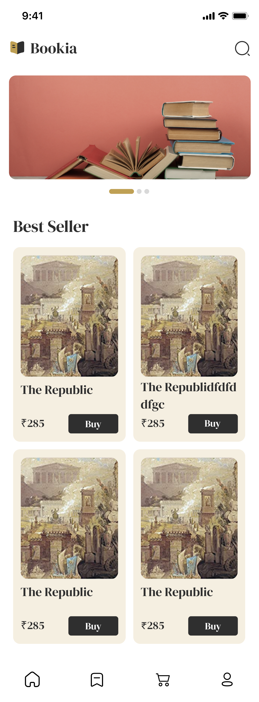

# Bookia 📚✨

Welcome to **Bookia**, your personal gateway to the world of books! Bookia is designed for book lovers who want a beautiful, easy, and fun way to discover, explore, and organize their reading journey.

## What is Bookia?
Bookia is a modern mobile app that brings together your favorite books in one place. Whether you love fiction, non-fiction, or anything in between, Bookia helps you find new reads, keep track of your collection, and share your passion for books.

## Features
- 🔍 **Smart Search:** Quickly find books by title, author, or category.
- 🏷️ **Categories:** Browse books by genres and discover new favorites.
- 📖 **Book Details:** See beautiful covers, summaries, and author info for every book.
- ⭐ **Bookmarks:** Save books you love for easy access later.
- 🏆 **Personal Library:** Organize your own collection and track what you’ve read.
- 🎨 **Elegant Design:** Enjoy a clean, attractive interface with custom icons and fonts.
- 👤 **Profile:** Personalize your experience and manage your reading journey.


```markdown

```

---

Made with ❤️ for book lovers everywhere.
